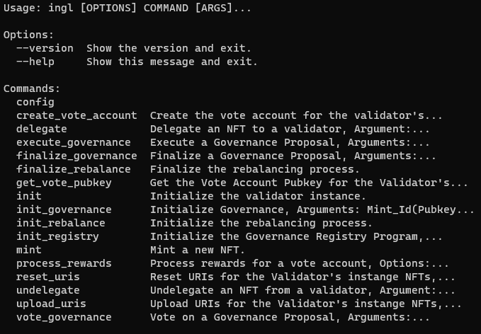

<p align="center">
  <a href="" rel="noopener">
 </a>
</p>
<h3 align="center">
Fractionalizing Validator Creation and Ownership</h3> 

## 

# CLI for interacting with Ingl Programs (Linux only Recommended)
## Installation
### Isolating an environment to prevent current or future environmental conflicts:
```
sudo apt-get install python-pip
pip install virtualenv
```
#### Creating the virtual environment (IsolEnv)
```
virtualenv IsolEnv
```

#### Activating the virtual environment
```
IsolEnv\Scripts\activate
```

### Installing Ingl in the Isolated virtual environment (IsolEnv)
```
pip install ingl
```

## Configurations
##### Setting the Default Program Id of the validator Instance
```
ingl config set -p <path to program_id keypair or program_id Pubkey>
```
##### Setting the Default Keypair used to sign transactions
```
ingl config set -k <path to keypair>
```
##### Setting the Default network the transactions are delivered to:
```
ingl confg set -u <devnet/mainnet/testnet or custom rpc url>
```

### To see the current configurations:
```
ingl config get
```


## Usage

### To display the list of instructions, 
``` 
ingl --help
```
</a>

### To Display the Arguments and options of an instruction,
```
ingl mint --help
```
